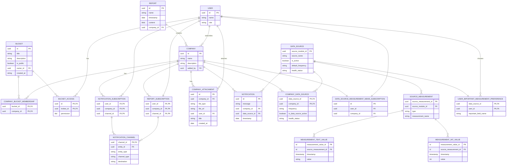

# `parma` data model

```mermaid
erDiagram
    BUCKET ||--o{ COMPANY_BUCKET_MEMBERSHIP : ""
    BUCKET ||--o{ BUCKET_ACCESS : ""
    COMPANY ||--o{ COMPANY_BUCKET_MEMBERSHIP : ""
    COMPANY ||--o{ NOTIFICATION_SUBSCRIPTION : "has"
    COMPANY ||--o{ REPORT_SUBSCRIPTION : ""
    COMPANY ||--o{ COMPANY_ATTACHMENT : "has"
    COMPANY ||--o{ NOTIFICATION : ""
    COMPANY ||--o{ COMPANY_DATA_SOURCE : ""
    COMPANY ||--|| DATA_SOURCE_MEASUREMENT_NEWS_SUBSCRIPTION :""
    DATA_SOURCE ||--o{ COMPANY_DATA_SOURCE : ""
    DATA_SOURCE ||--o{ SOURCE_MEASUREMENT : ""
    DATA_SOURCE ||--o{ NOTIFICATION : ""
    DATA_SOURCE ||--|| USER_IMPORTANT_MEASUREMENT_PREFERENCE : ""
    NOTIFICATION_SUBSCRIPTION ||--o{ NOTIFICATION_CHANNEL : ""
    REPORT ||--o{ COMPANY : "contains"
    REPORT_SUBSCRIPTION ||--o{ NOTIFICATION_CHANNEL : ""
    USER ||--o{ USER_IMPORTANT_MEASUREMENT_PREFERENCE : "chooses"
    USER ||--o{ NOTIFICATION_SUBSCRIPTION : ""
    USER ||--|| REPORT_SUBSCRIPTION : ""
    USER ||--o{ COMPANY : "subscribes"
    USER ||--o{ BUCKET_ACCESS : "has"
    USER ||--|| DATA_SOURCE_MEASUREMENT_NEWS_SUBSCRIPTION :""
    USER ||--o{ COMPANY_ATTACHMENT : "attaches"
    SOURCE_MEASUREMENT ||--o{ MEASUREMENT_TEXT_VALUE : ""
    SOURCE_MEASUREMENT ||--o{ MEASUREMENT_INT_VALUE : ""
    BUCKET {
        uuid id PK
        string title
        string description
        boolean is_public
        uuid owner_id FK
        string created_at
    }
    BUCKET_ACCESS{
        uuid id PK,FK
        uuid invitee_id PK,FK
        tbd  permission
    }
    COMPANY {
        uuid id PK
        string name
        string description
        uuid added_by FK
    }
    COMPANY_ATTACHMENT {
        uuid id PK
        uuid company_id FK
        string file_type
        string file_url
        uuid user_id FK
        string title
        date created_at
    }
    COMPANY_BUCKET_MEMBERSHIP{
        uuid bucket_id PK,FK
        uuid company_id PK,FK
    }
    COMPANY_DATA_SOURCE {
        uuid data_source_id PK, FK
        uuid company_id PK, FK
        string frequency
        boolean is_data_source_active
        string health_status
    }
    DATA_SOURCE {
        uuid source_module_id PK
        string source_name
        boolean is_active
        string default_frequency
        string health_status
    }
    DATA_SOURCE_MEASUREMENT_NEWS_SUBSCRIPTION{
        uuid id PK
        uuid user_id FK
        uuid company_id FK
    }
    NOTIFICATION {
        uuid id PK
        string message
        uuid company_id FK
        uuid data_source_id FK
        date timestamp
    }
    NOTIFICATION_CHANNEL {
        uuid channel_id PK, FK
        uuid entity_id FK
        string entity_type
        string channel_type
        string destination
    }
    NOTIFICATION_SUBSCRIPTION {
        uuid user_id FK, PK
        uuid company_id FK, PK
        uuid channel_id FK, PK
    }
    REPORT{
        uuid id PK
        string name
        date timestamp
        blob content
        uuid company_id FK
    }
    REPORT_SUBSCRIPTION {
        uuid user_id FK, PK
        uuid company_id FK, PK
        uuid channel_id FK, PK
    }
    SOURCE_MEASUREMENT {
        uuid source_measurement_id PK
        uuid source_module_id FK
        string type
        string measurement_name
    }
    USER {
        uuid id PK
        string name
        string role
    }
    USER_IMPORTANT_MEASUREMENT_PREFERENCE {
        uuid data_source_id PK, FK
        uuid user_id PK, FK
        string important_field_name
    }
    MEASUREMENT_TEXT_VALUE {
        id measurement_value_id PK
        id source_measurement_id FK
        timestamp timestamp
        string value
    }
    MEASUREMENT_INT_VALUE {
        id measurement_value_id PK
        id source_measurement_id FK
        timestamp timestamp
        int value
    }
```
