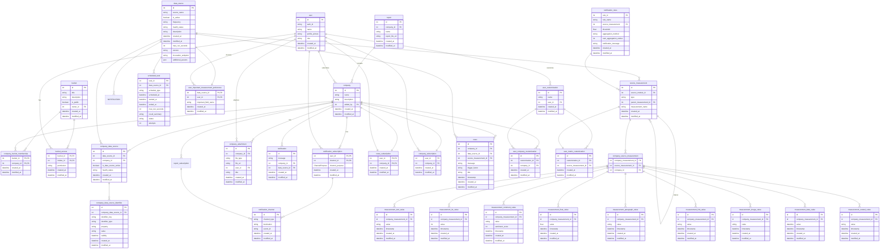

# `parma` data model

```mermaid
erDiagram
    bucket ||--o{ company_bucket_membership : ""
    bucket ||--o{ bucket_access : ""
    company ||--o{ company_bucket_membership : ""
    company ||--o{ notification_subscription : "has"
    company ||--o{ report_subscription : ""
    company ||--o{ company_attachment : "has"
    company ||--o{ notification : ""
    company ||--o{ company_data_source : ""
    company ||--|| news_subscription :""
    company ||--|| company_subscription : ""
    company ||--o{ news : ""
    company ||--o{ user_company_customization : ""
    data_source ||--o{ news : ""
    data_source ||--o{ company_data_source : ""
    data_source ||--o{ source_measurement : ""
    data_source ||--o{ NOTIFICATION : ""
    data_source ||--o{ scheduled_task : ""
    data_source ||--|| user_important_measurement_preference : ""
    company_data_source ||--o{ company_data_source_identifier : ""
    notification_subscription ||--o{ notification_channel : ""
    report ||--o{ company : "contains"
    report_subscription ||--o{ notification_channel : ""
    user ||--o{ user_important_measurement_preference : "chooses"
    user ||--o{ notification_subscription : ""
    user ||--o{ company : "subscribes"
    user ||--o{ bucket_access : "has"
    user ||--|| news_subscription :""
    user ||--o{ company_attachment : "attaches"
    user ||--o{ company_subscription : ""
    user ||--o{ user_customization : "customize"
    user_customization ||--o{ user_company_customization : ""
    user_customization ||--o{ user_metric_customization : ""
    source_measurement ||--o{ source_measurement : "child of"
    source_measurement ||--o{ company_source_measurement : ""
    source_measurement ||--|| user_metric_customization : ""
    company_source_measurement ||--o{ measurement_text_value : ""
    company_source_measurement ||--o{ measurement_int_value : ""
    company_source_measurement ||--o{ measurement_comment_value : ""
    company_source_measurement ||--o{ measurement_float_value : ""
    company_source_measurement ||--o{ measurement_paragraph_value : ""
    company_source_measurement ||--o{ measurement_link_value : ""
    company_source_measurement ||--o{ measurement_image_value : ""
    company_source_measurement ||--o{ measurement_date_value : ""
    company_source_measurement ||--o{ measurement_nested_value : ""

    notification_rules ||--o{ source_measurement : ""

    bucket {
        int id PK
        string title
        string description
        boolean is_public
        int owner_id FK
        datetime created_at
        datetime modified_at
    }
    bucket_access{
        int bucket_id PK,FK
        int invitee_id PK,FK
        string permission
        datetime created_at
        datetime modified_at

    }
    company {
        int id PK
        string name
        string description
        int added_by FK
        datetime created_at
        datetime modified_at
    }
    company_attachment {
        int id PK
        int company_id FK
        string file_type
        string file_url
        int user_id FK
        string title
        datetime created_at
        datetime modified_at
    }
    company_bucket_membership {
        int bucket_id PK,FK
        int company_id PK,FK
        datetime created_at
        datetime modified_at
    }
    company_data_source {
        int id PK
        int data_source_id FK
        int company_id FK
        boolean is_data_source_active
        string health_status
        datetime created_at
        datetime modified_at
    }
    data_source {
        int id PK
        string source_name
        boolean is_active
        string frequency
        string health_status
        string description
        datetime created_at
        datetime modified_at
        int max_run_seconds
        string version
        string invocation_endpoint
        json additional_params
    }
    scheduled_task {
        int task_id PK
        int data_source_id FK
        string schedule_type
        datetime scheduled_at
        datetime started_at
        datetime ended_at
        int max_run_seconds
        string result_summary
        string status
        int attempts
    }
    news_subscription {
        int user_id PK,FK
        int company_id PK,FK
        datetime created_at
        datetime modified_at
    }
    notification {
        int id PK
        string message
        int company_id FK
        int data_source_id FK
        datetime created_at
        datetime modified_at
    }
    notification_channel {
        int id PK
        string channel_type
        string destination
        string secret_id
        datetime created_at
        datetime modified_at
    }
    notification_subscription {
        int user_id FK, PK
        int channel_id FK, PK
        ChannelPurpose channel_purpose
        datetime created_at
        datetime modified_at
    }
    notification_rules {
        int rule_id PK
        string rule_name
        int source_measurement FK
        float threshold
        string aggregation_method
        int num_aggregation_entries
        string notification_message
        datetime created_at
        datetime modified_at
    }
    report{
        int id PK
        int company_id FK
        string name
        string report_file_url
        datetime created_at
        datetime modified_at
    }
    source_measurement {
        int id PK
        int source_module_id FK
        string type
        int parent_measurement_id FK
        string measurement_name
        datetime created_at
        datetime modified_at
    }
    company_source_measurement {
        int company_measurement_id PK
        int source_measurement_id FK
        int company_id FK
    }
    user {
        int id PK
        string auth_id
        string name
        string profile_picture
        string role
        datetime created_at
        datetime modified_at
    }
    user_important_measurement_preference {
        int data_source_id PK,FK
        int user_id PK,FK
        string important_field_name
        datetime created_at
        datetime modified_at
    }
    measurement_text_value {
        id id PK
        id company_measurement_id FK
        string value
        datetime timestamp
        datetime created_at
        datetime modified_at
    }
    measurement_int_value {
        id id PK
        id company_measurement_id FK
        int value
        datetime timestamp
        datetime created_at
        datetime modified_at
    }
    measurement_float_value {
        id id PK
        id company_measurement_id FK
        float value
        datetime timestamp
        datetime created_at
        datetime modified_at
    }
    measurement_comment_value {
        id id PK
        id company_measurement_id FK
        string value
        int sentiment_score
        datetime timestamp
        datetime created_at
        datetime modified_at
    }
    measurement_paragraph_value {
        id id PK
        id company_measurement_id FK
        string value
        datetime timestamp
        datetime created_at
        datetime modified_at
    }
    measurement_link_value {
        id id PK
        id company_measurement_id FK
        string value
        datetime timestamp
        datetime created_at
        datetime modified_at
    }
    measurement_image_value {
        id id PK
        id company_measurement_id FK
        string value
        datetime timestamp
        datetime created_at
        datetime modified_at
    }
    measurement_date_value {
        id id PK
        id company_measurement_id FK
        datetime value
        datetime timestamp
        datetime created_at
        datetime modified_at
    }
    measurement_nested_value {
        id id PK
        id company_measurement_id FK
        string value
        datetime timestamp
        datetime created_at
        datetime modified_at
    }
    news {
        int id PK
        int company_id FK
        int data_source_id FK
        int source_measurement_id FK
        string message
        string trigger_factor
        string title
        datetiem timestamp
        datetime created_at
        datetime modified_at
    }

    user_customization {
        int id PK
        string name
        int user_id FK
        datetime created_at
        datetime modified_at
    }

    user_company_customization {
        int id PK
        int customization_id FK
        int company_id FK
        datetime created_at
        datetime modified_at
    }

    user_metric_customization {
        int id PK
        int customization_id FK
        int source_measurement_id FK
        datetime created_at
        datetime modified_at
    }

    company_subscription {
        int user_id FK
        int company_id FK
        datetime created_at
        datetime modified_at
    }

    company_data_source_identifier {
        int id PK
        int company_data_source_id FK
        string identifier_key
        string identifier_type
        string property
        string value
        datetime validity
        datetime created_at
        datetime modified_at
    }

```
